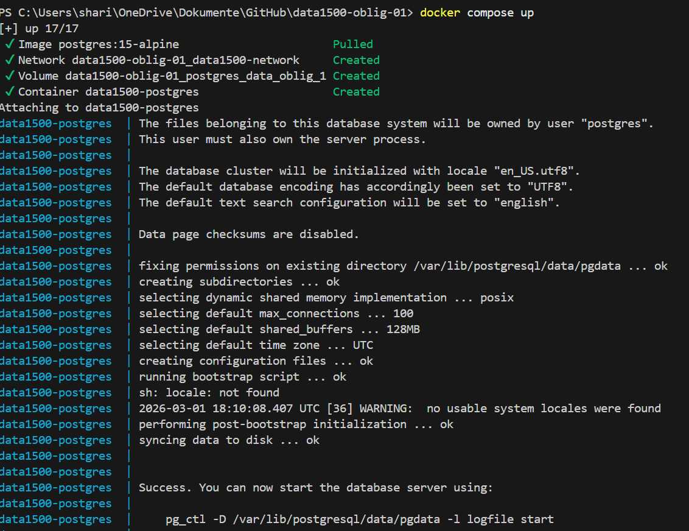
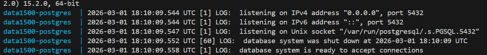
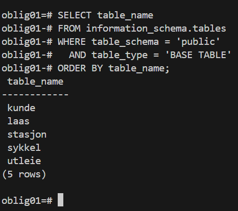

# Besvarelse - Refleksjon og Analyse

**Student:** Mohammed Omran Sharifi

**Studentnummer:** mosha1930

**Dato:** 01.03.26

---

## Del 1: Datamodellering

### Oppgave 1.1: Entiteter og attributter

**Identifiserte entiteter:**

Kunde, Stasjon, Lås, Sykkel, Utleie og Betaling.

**Attributter for hver entitet:**

Kunde:
Formål: Systemet må identifisere hvem som leier sykler, og kunne kontakte kunden via mobil/epost.

Attributter:

kunde_id (PK) 
mobilnummer 
epost 
fornavn
etternavn

Begrunnelse: Case sier eksplisitt at kunder registreres med mobilnummer, epost, fornavn og etternavn. En intern nøkkel (kunde_id) til gjør det lett å refere til kunde selv om kontaktinfo endres.

Stasjon:
Formål: Systemet består av sykkelstasjoner hvor sykler kan hentes og leveres.

Attributter:

stasjon_id (PK)
navn
adresse/område
breddegrad
lengdegrad

Begrunnelse: Systemet må holde styr på “hvilke sykler er tilgjengelige på hvilke stasjoner (sted)”. Navn og lokasjonsinfo gjør stasjonen brukbar for app/bruker. Koordinater er relevant for “sted” og typisk i bysykkel.

Lås:
Formål: Hver sykkel er låst fast med en lås ved en stasjon. En stasjon har mange låser.

Attributter:

lås_id (PK)
stasjon_id (FK → Stasjon)
låsnr

Begrunnelse: Hintet sier at en stasjon har mange låser, og at sykler låses til en tilfeldig lås på en stasjon. For å vite hvor en sykkel står, må vi kunne peke på en konkret lås (ikke bare stasjonen).

Sykkel:
Formål: Hver sykkel har unik ID og er enten parkert (ved en lås på en stasjon) eller utleid.

Attributter:

sykkel_id (PK)
stasjon_id (FK → Stasjon, NULL mulig)
lås_id (FK → Lås, NULL mulig)
modell/merke 

Begrunnelse: Caset krever at systemet holder styr på hvilke sykler som er tilgjengelige på hvilke stasjoner, og hvilke som er utleid. Hintet foreslår modellering ved at en utleid sykkel har NULL for stasjon og lås.

Utleie:
Formål: Registrere selve leieforholdet: hvem som leier hvilken sykkel, når den tas ut, når den leveres inn, og hva det kostet.

Attributter:

utleie_id (PK)
kunde_id (FK → Kunde)
sykkel_id (FK → Sykkel)
utlevert_tid (timestamp)
innlevert_tid (timestamp, NULL mulig)
start_stasjon_id (FK → Stasjon)
slutt_stasjon_id (FK → Stasjon, NULL mulig)
leiebeløp (numeric)

Begrunnelse: Caset sier at utleietidspunkt og innleveringstidspunkt skal registreres, og at kunden betaler for tidsintervallet. Det er også eksplisitt at leiebeløpet skal registreres på den gjeldende utleien. NULL på innlevert_tid støtter hintet om “pågående utleie”.

### Oppgave 1.2: Datatyper og `CHECK`-constraints

**Valgte datatyper og begrunnelser:**

Kunde

kunde_id: BIGSERIAL – autoinkrementerende primærnøkkel som skalerer godt.
mobilnummer: TEXT – lagres som tekst for å bevare ledende nuller og fordi det ikke skal brukes i regning.
epost: TEXT – epost er tekstlig identifikator og lagres best som tekst.
fornavn: TEXT – navn er tekst.
etternavn: TEXT – navn er tekst.

Stasjon

stasjon_id: BIGSERIAL – autoinkrementerende primærnøkkel.
navn: TEXT – stasjonsnavn er tekst.
adresse: TEXT – adresse/område er tekst.
breddegrad: NUMERIC(9,6) – koordinater krever desimalpresisjon; numeric gir kontrollert presisjon.
lengdegrad: NUMERIC(9,6) – som over.

Lås

lås_id: BIGSERIAL – autoinkrementerende primærnøkkel.
stasjon_id: BIGINT – fremmednøkkel som peker til stasjon(stasjon_id) (samme “familie” som BIGSERIAL).
låsnr: INTEGER – fysisk nummer på lås er et heltall.
aktiv: BOOLEAN – naturlig ja/nei-verdi for om låsen er i drift.

Sykkel

sykkel_id: BIGSERIAL – unik sykkel-ID, autoinkrementerende.
stasjon_id: BIGINT – fremmednøkkel til stasjon, men kan være NULL når sykkelen er utleid (hint i oppgaven).
lås_id: BIGINT – fremmednøkkel til lås, men kan være NULL når sykkelen er utleid.
aktiv: BOOLEAN – om sykkelen er i drift.
modell: TEXT – beskrivende tekst (valgfri).

Utleie

utleie_id: BIGSERIAL – autoinkrementerende primærnøkkel.
kunde_id: BIGINT – fremmednøkkel til kunde(kunde_id).
sykkel_id: BIGINT – fremmednøkkel til sykkel(sykkel_id).
utlevert_tid: TIMESTAMPTZ – tidspunkt for utlevering med tidssone.
innlevert_tid: TIMESTAMPTZ – tidspunkt for innlevering med tidssone, kan være NULL ved aktiv utleie.
start_stasjon_id: BIGINT – fremmednøkkel til stasjon, hvor utleie starter.
slutt_stasjon_id: BIGINT – fremmednøkkel til stasjon, hvor utleie slutter, kan være NULL ved aktiv utleie.
leiebeløp: NUMERIC(10,2) – valuta bør lagres som numeric (ikke flyttall) for å unngå avrundingsfeil; 2 desimaler er standard.

**`CHECK`-constraints:**

Kunde: mobilnummerformat

CHECK (mobilnummer ~ '^[0-9]{8,15}$')
Begrunnelse: Sikrer at mobilnummer kun inneholder sifre og har en rimelig lengde (8–15). Tekstformat gjør at ledende nuller beholdes.

Kunde: epostformat

CHECK (epost ~* '^[A-Z0-9._%+-]+@[A-Z0-9.-]+\.[A-Z]{2,}$')
Begrunnelse: Enkel validering som fanger vanlige epost-feil (mangler @, domene osv.). ~* gjør sjekken case-insensitiv.

Kunde: ikke-tomme navn

CHECK (length(trim(fornavn)) > 0)
CHECK (length(trim(etternavn)) > 0)
Begrunnelse: Hindrer at navn lagres som tom streng eller kun mellomrom.

Stasjon: ikke-tomme felt

CHECK (length(trim(navn)) > 0)
CHECK (length(trim(adresse)) > 0)
Begrunnelse: Stasjon må ha navn og en form for stedsbeskrivelse.

Stasjon: gyldige koordinater

CHECK (breddegrad BETWEEN -90 AND 90)
CHECK (lengdegrad BETWEEN -180 AND 180)
Begrunnelse: Sikrer at koordinater er innenfor gyldige geografiske intervaller.

Lås: positivt låsnummer

CHECK (låsnr > 0)
Begrunnelse: Fysisk nummerering bør være positive heltall.

Sykkel: konsistens mellom stasjon og lås

CHECK ( (stasjon_id IS NULL AND lås_id IS NULL) OR (stasjon_id IS NOT NULL AND lås_id IS NOT NULL) )
Begrunnelse: Følger hintet: en utleid sykkel modelleres ved at den ikke har registrert stasjon og lås (begge NULL). Hvis sykkelen er parkert, må både stasjon og lås være satt (ikke “halv-plassering”).

Sykkel: modell hvis satt må være ikke-tom

CHECK (modell IS NULL OR length(trim(modell)) > 0)
Begrunnelse: Valgfritt felt, men skal ikke kunne være tom streng.

Utleie: innlevering kan ikke være før utlevering

CHECK (innlevert_tid IS NULL OR innlevert_tid >= utlevert_tid)
Begrunnelse: Sikrer tidsrekkefølge i leieperioden.

Utleie: konsistens mellom innlevert_tid og slutt_stasjon_id

CHECK ( (innlevert_tid IS NULL AND slutt_stasjon_id IS NULL) OR (innlevert_tid IS NOT NULL AND slutt_stasjon_id IS NOT NULL) )
Begrunnelse: Når utleien er aktiv (ingen innleveringstid), skal det heller ikke finnes sluttstasjon. Når den er avsluttet, må både innleveringstid og sluttstasjon være registrert.

Utleie: ikke-negativt leiebeløp

CHECK (leiebeløp >= 0)
Begrunnelse: Hindrer negative beløp. 0 kan være gyldig ved gratisleie/kampanje.

**ER-diagram:**
erDiagram
    KUNDE {
        BIGSERIAL kunde_id PK
        TEXT mobilnummer
        TEXT epost
        TEXT fornavn
        TEXT etternavn
    }

    STASJON {
        BIGSERIAL stasjon_id PK
        TEXT navn
        TEXT adresse
        NUMERIC(9,6) breddegrad
        NUMERIC(9,6) lengdegrad
    }

    LAAS {
        BIGSERIAL laas_id PK
        BIGINT stasjon_id FK
        INTEGER laasnr
        BOOLEAN aktiv
    }

    SYKKEL {
        BIGSERIAL sykkel_id PK
        BIGINT stasjon_id FK  "NULL når utleid"
        BIGINT laas_id FK     "NULL når utleid"
        BOOLEAN aktiv
        TEXT modell
    }

    UTLEIE {
        BIGSERIAL utleie_id PK
        BIGINT kunde_id FK
        BIGINT sykkel_id FK
        TIMESTAMPTZ utlevert_tid
        TIMESTAMPTZ innlevert_tid "NULL når aktiv"
        BIGINT start_stasjon_id FK
        BIGINT slutt_stasjon_id FK "NULL når aktiv"
        NUMERIC(10,2) leiebelop
    }

    STASJON ||--o{ LAAS : "har"
    STASJON ||--o{ SYKKEL : "har (når parkert)"
    LAAS ||--o{ SYKKEL : "holder (når parkert)"
    KUNDE ||--o{ UTLEIE : "gjør"
    SYKKEL ||--o{ UTLEIE : "brukes i"
    STASJON ||--o{ UTLEIE : "start"
    STASJON ||--o{ UTLEIE : "slutt"
---

### Oppgave 1.3: Primærnøkler

**Valgte primærnøkler og begrunnelser:**
Kunde (kunde): kunde_id som PK
Begrunnelse: Mobilnummer og epost kan endres over tid (nytt nummer/epost), og det er bedre å ha en stabil intern identifikator som ikke påvirkes av endringer i kontaktinformasjon.

Stasjon (stasjon): stasjon_id som PK
Begrunnelse: Stasjonsnavn kan i prinsippet endres (f.eks. omdøping), og flere stasjoner kan ha like/tilsvarende navn. En intern ID er stabil og gjør FK-er enkle.

Lås (lås): lås_id som PK
Begrunnelse: En lås må kunne identifiseres entydig på tvers av hele systemet. Selv om låsnr kan være unik per stasjon, er det praktisk å bruke én enkel nøkkel som FK-mål fra sykkel.

Sykkel (sykkel): sykkel_id som PK
Begrunnelse: Caset sier at hver sykkel har en unik ID. Den kan fungere som en primærnøkkel direkte (implementert som en surrogatnøkkel/sekvens i databasen).

Utleie (utleie): utleie_id som PK
Begrunnelse: Utleie-hendelser trenger en egen identifikator. En naturlig nøkkel som (kunde_id, sykkel_id, utlevert_tid) kan i teorien fungere, men blir upraktisk og sårbar (tidsstempel som del av PK), og gjør referanser til utleie vanskeligere. En enkel surrogat-ID er mest robust.

**Naturlige vs. surrogatnøkler:**

Jeg har i hovedsak brukt surrogatnøkler (BIGSERIAL) som primærnøkler for alle entitetene. Grunnen er:

Stabilitet over tid: Naturlige nøkler som mobilnummer, epost og navn kan endres, og da ville primærnøkkelen måtte endres (eller man må lage kompliserte løsninger). Surrogatnøkler endres ikke.

Enklere relasjoner: Fremmednøkler blir korte og konsistente (BIGINT), og spørringer/joins blir enklere og mer effektive.

Unike krav kan fortsatt håndheves: Selv om mobilnummer og epost kunne vært naturlige nøkler, er de bedre som kandidatnøkler (UNIQUE) i stedet for PK. På samme måte kan låsnr være unik per stasjon, men det håndheves best med en unik constraint (UNIQUE (stasjon_id, låsnr)) heller enn som sammensatt PK.

Naturlige nøkkel-kandidater som håndheves separat:

kunde.mobilnummer (unik)
kunde.epost (unik)
lås: kombinasjonen (stasjon_id, låsnr) kan være unik per stasjon

Disse er gode kandidater for UNIQUE, men jeg bruker fortsatt surrogat-PK for enklere design.

**Oppdatert ER-diagram:**

erDiagram
    KUNDE {
        BIGSERIAL kunde_id PK
        TEXT mobilnummer
        TEXT epost
        TEXT fornavn
        TEXT etternavn
    }

    STASJON {
        BIGSERIAL stasjon_id PK
        TEXT navn
        TEXT adresse
        NUMERIC(9,6) breddegrad
        NUMERIC(9,6) lengdegrad
    }

    LAAS {
        BIGSERIAL laas_id PK
        BIGINT stasjon_id FK
        INTEGER laasnr
        BOOLEAN aktiv
    }

    SYKKEL {
        BIGSERIAL sykkel_id PK
        BIGINT stasjon_id FK  "NULL når utleid"
        BIGINT laas_id FK     "NULL når utleid"
        BOOLEAN aktiv
        TEXT modell
    }

    UTLEIE {
        BIGSERIAL utleie_id PK
        BIGINT kunde_id FK
        BIGINT sykkel_id FK
        TIMESTAMPTZ utlevert_tid
        TIMESTAMPTZ innlevert_tid "NULL når aktiv"
        BIGINT start_stasjon_id FK
        BIGINT slutt_stasjon_id FK "NULL når aktiv"
        NUMERIC(10,2) leiebelop
    }

    STASJON ||--o{ LAAS : "har"
    STASJON ||--o{ SYKKEL : "har (når parkert)"
    LAAS ||--o{ SYKKEL : "holder (når parkert)"
    KUNDE ||--o{ UTLEIE : "gjør"
    SYKKEL ||--o{ UTLEIE : "brukes i"
    STASJON ||--o{ UTLEIE : "start"
    STASJON ||--o{ UTLEIE : "slutt"
---

### Oppgave 1.4: Forhold og fremmednøkler

**Identifiserte forhold og kardinalitet:**

Identifiserte forhold og kardinalitet:

Stasjon – Lås
Forhold: En stasjon har mange låser, og hver lås tilhører nøyaktig én stasjon.
Kardinalitet: 1–til–mange (Stasjon 1 → * Lås)
Stasjon – Sykkel (parkering/tilgjengelighet)
Forhold: En stasjon kan ha mange sykler parkert, og en sykkel kan være parkert på maks én stasjon om gangen (eller være utleid).
Kardinalitet: 1–til–mange (Stasjon 1 → * Sykkel), men med mulighet for NULL på sykkel for “utleid”.
Lås – Sykkel (låsing)
Forhold: En lås kan holde maks én sykkel om gangen (fysisk plass), og en sykkel kan være i maks én lås om gangen (eller være utleid).
Kardinalitet: I praksis 1–til–0/1 i begge retninger (en lås har 0 eller 1 sykkel; en sykkel er i 0 eller 1 lås).
Implementeres som en FK fra sykkel til lås + en unikhetsregel på sykkel.lås_id (for å sikre at samme lås ikke kan ha flere sykler samtidig).
Kunde – Utleie
Forhold: En kunde kan ha mange utleier over tid, men hver utleie tilhører nøyaktig én kunde.
Kardinalitet: 1–til–mange (Kunde 1 → * Utleie)
Sykkel – Utleie
Forhold: En sykkel kan leies mange ganger over tid, men hver utleie gjelder nøyaktig én sykkel.
Kardinalitet: 1–til–mange (Sykkel 1 → * Utleie)
Stasjon – Utleie (start)
Forhold: En utleie starter ved én stasjon, og en stasjon kan være start for mange utleier.
Kardinalitet: 1–til–mange (Stasjon 1 → * Utleie)
Stasjon – Utleie (slutt)
Forhold: En utleie avsluttes ved én stasjon (når innlevert), og en stasjon kan være slutt for mange utleier. Under aktiv utleie er sluttstasjon ukjent/NULL.
Kardinalitet: 1–til–mange (Stasjon 1 → * Utleie), med NULL mulig i utleie mens utleien er aktiv.

Det finnes ingen nødvendig “ren” mange-til-mange-relasjon i denne modellen som må løses opp med koblingstabell. For eksempel kan “kunde leier sykkel” se ut som M–M over tid, men dette er nettopp det utleie-entiteten modellerer (assosiativ entitet med egne attributter som tidsstempler og beløp). Dermed er M–M allerede “løst opp” ved utleie.

**Fremmednøkler:**

lås.stasjon_id → stasjon.stasjon_id
Implementerer Stasjon 1 → * Lås.
Hver lås peker til nøyaktig én stasjon.
sykkel.stasjon_id → stasjon.stasjon_id (NULL mulig)
Implementerer Stasjon 1 → * Sykkel (parkert).
Når sykkelen er utleid settes stasjon_id til NULL (i tråd med hintet).
sykkel.lås_id → lås.lås_id (NULL mulig)
Implementerer forholdet mellom sykkel og lås (plass i stativ).
NULL når sykkelen er utleid.
utleie.kunde_id → kunde.kunde_id
Implementerer Kunde 1 → * Utleie.
utleie.sykkel_id → sykkel.sykkel_id
Implementerer Sykkel 1 → * Utleie.
utleie.start_stasjon_id → stasjon.stasjon_id
Implementerer Stasjon 1 → * Utleie (start).
utleie.slutt_stasjon_id → stasjon.stasjon_id (NULL mulig)
Implementerer Stasjon 1 → * Utleie (slutt).
NULL mulig mens utleien er aktiv.

For å sikre at en lås ikke kan ha flere sykler samtidig, bør sykkel.lås_id være UNIQUE (for ikke-null verdier). Dette er ikke en fremmednøkkel, men en nødvendig constraint for å håndheve kardinaliteten (0/1 sykkel per lås).

**Oppdatert ER-diagram:**

erDiagram
    KUNDE {
        BIGSERIAL kunde_id PK
        TEXT mobilnummer
        TEXT epost
        TEXT fornavn
        TEXT etternavn
    }

    STASJON {
        BIGSERIAL stasjon_id PK
        TEXT navn
        TEXT adresse
        NUMERIC(9,6) breddegrad
        NUMERIC(9,6) lengdegrad
    }

    LAAS {
        BIGSERIAL laas_id PK
        BIGINT stasjon_id FK
        INTEGER laasnr
        BOOLEAN aktiv
    }

    SYKKEL {
        BIGSERIAL sykkel_id PK
        BIGINT stasjon_id FK  "NULL når utleid"
        BIGINT laas_id FK     "NULL når utleid"
        BOOLEAN aktiv
        TEXT modell
    }

    UTLEIE {
        BIGSERIAL utleie_id PK
        BIGINT kunde_id FK
        BIGINT sykkel_id FK
        TIMESTAMPTZ utlevert_tid
        TIMESTAMPTZ innlevert_tid "NULL når aktiv"
        BIGINT start_stasjon_id FK
        BIGINT slutt_stasjon_id FK "NULL når aktiv"
        NUMERIC(10,2) leiebelop
    }

    STASJON ||--o{ LAAS : "1 stasjon har mange låser"
    STASJON ||--o{ SYKKEL : "1 stasjon har mange sykler (parkert)"
    LAAS ||--o| SYKKEL : "1 lås har 0/1 sykkel"
    KUNDE ||--o{ UTLEIE : "1 kunde har mange utleier"
    SYKKEL ||--o{ UTLEIE : "1 sykkel har mange utleier"
    STASJON ||--o{ UTLEIE : "start"
    STASJON ||--o{ UTLEIE : "slutt"

---

### Oppgave 1.5: Normalisering

**Vurdering av 1. normalform (1NF):**

Datamodellen tilfredsstiller 1NF fordi:

Alle tabeller har atomiske attributter (én verdi per kolonne per rad). For eksempel lagres mobilnummer som ett felt, epost som ett felt, og koordinater som separate verdier (breddegrad, lengdegrad).

Det finnes ingen repeterende grupper eller “listekolonner” (f.eks. flere mobilnumre i samme felt).

Hver tabell har en primærnøkkel som identifiserer rader entydig (kunde_id, stasjon_id, lås_id, sykkel_id, utleie_id).

Derfor er modellen i 1NF.

**Vurdering av 2. normalform (2NF):**

Datamodellen tilfredsstiller 2NF fordi:

2NF gjelder spesielt når man har sammensatte primærnøkler, og man må sikre at ingen ikke-nøkkelattributter er delvis avhengige av bare en del av nøkkelen.

I denne modellen bruker jeg surrogatnøkler (enkeltkolonne-PK) for alle tabeller. Det betyr at alle ikke-nøkkelattributter i en tabell er avhengige av hele primærnøkkelen (fordi PK er én kolonne).

Eksempel: I utleie er attributter som utlevert_tid, innlevert_tid, leiebeløp avhengige av utleie_id (hele nøkkelen), ikke av en del av en sammensatt nøkkel.

Dermed er modellen i 2NF.

**Vurdering av 3. normalform (3NF):**

Datamodellen tilfredsstiller 3NF fordi:

3NF krever at tabeller er i 2NF, og at det ikke finnes transitive avhengigheter: ingen ikke-nøkkelattributt skal være avhengig av en annen ikke-nøkkelattributt (kun av primærnøkkelen).

I hver tabell beskriver attributtene kun egenskaper ved “tingen” tabellen representerer:

kunde: mobilnummer, epost, fornavn, etternavn beskriver kunden og er avhengige av kunde_id. Det er ingen kolonne som kan utledes av en annen i samme tabell (vi lagrer f.eks. ikke fullt navn i tillegg).

stasjon: navn, adresse, breddegrad, lengdegrad beskriver stasjonen og er avhengige av stasjon_id. Ingen av disse er avhengig av hverandre som en transitive avhengighet.

lås: stasjon_id, låsnr, aktiv beskriver låsen og er avhengige av lås_id.

stasjon_id er en FK, men det skaper ikke brudd på 3NF; det refererer bare til en annen entitet.

låsnr er en egenskap ved låsen (og typisk unik per stasjon via constraint), men den ligger korrekt i lås-tabellen.

sykkel: stasjon_id, lås_id, aktiv, modell beskriver sykkelen og er avhengige av sykkel_id.

Lokasjon er modellert via FK-er (eller NULL når utleid). Det lagres ikke redundant informasjon som både stasjonnavn og stasjon_id i sykkel, som ellers kunne gitt transitive avhengigheter.

utleie: kunde_id, sykkel_id, utlevert_tid, innlevert_tid, start_stasjon_id, slutt_stasjon_id, leiebeløp er alle egenskaper ved en utleiehendelse og avhenger av utleie_id.

Vi lagrer ikke kundeinfo (mobil/epost) i utleie, kun kunde_id. Dermed unngås redundans og transitive avhengigheter.

Vi lagrer heller ikke stasjonsnavn/adresse i utleie, kun stasjon_id-er.

En mulig fallgruve kunne vært dersom vi lagret både stasjon_id og stasjon_navn i samme tabell (som da kunne vært transitivt avhengig), men det gjør vi ikke. Derfor er modellen i 3NF.

## Del 2: Database-implementering

### Oppgave 2.1: SQL-skript for database-initialisering

**Plassering av SQL-skript:**

Jeg har laget sql skriptet

**Antall testdata:**

- Kunder: 5
- Sykler: 100
- Sykkelstasjoner: 5
- Låser: 100
- Utleier: 50

---

### Oppgave 2.2: Kjøre initialiseringsskriptet

**Dokumentasjon av vellykket kjøring:**

[Skriv ditt svar her - f.eks. skjermbilder eller output fra terminalen som viser at databasen ble opprettet uten feil]


**Spørring mot systemkatalogen:**

```sql
SELECT table_name 
FROM information_schema.tables 
WHERE table_schema = 'public' 
  AND table_type = 'BASE TABLE'
ORDER BY table_name;
```

**Resultat:**



## Del 3: Tilgangskontroll

### Oppgave 3.1: Roller og brukere

**SQL for å opprette rolle:**

CREATE ROLE kunde;

REVOKE ALL ON SCHEMA public FROM kunde;

**SQL for å opprette bruker:**

CREATE USER kunde_1 WITH PASSWORD 'kunde123';

GRANT kunde TO kunde_1;

**SQL for å tildele rettigheter:**

GRANT USAGE ON SCHEMA public TO kunde;

GRANT SELECT ON TABLE
    kunde,
    stasjon,
    laas,
    sykkel,
    utleie
TO kunde;

ALTER DEFAULT PRIVILEGES IN SCHEMA public
GRANT SELECT ON TABLES TO kunde;
---

### Oppgave 3.2: Begrenset visning for kunder

**SQL for VIEW:**

```sql
[Skriv din SQL-kode for VIEW her]
```

**Ulempe med VIEW vs. POLICIES:**

[Skriv ditt svar her - diskuter minst én ulempe med å bruke VIEW for autorisasjon sammenlignet med POLICIES]

---

## Del 4: Analyse og Refleksjon

### Oppgave 4.1: Lagringskapasitet

**Gitte tall for utleierate:**

- Høysesong (mai-september): 20000 utleier/måned
- Mellomsesong (mars, april, oktober, november): 5000 utleier/måned
- Lavsesong (desember-februar): 500 utleier/måned

**Totalt antall utleier per år:**

[Skriv din utregning her]

**Estimat for lagringskapasitet:**

[Skriv din utregning her - vis hvordan du har beregnet lagringskapasiteten for hver tabell]

**Totalt for første år:**

[Skriv ditt estimat her]

---

### Oppgave 4.2: Flat fil vs. relasjonsdatabase

**Analyse av CSV-filen (`data/utleier.csv`):**

**Problem 1: Redundans**

[Skriv ditt svar her - gi konkrete eksempler fra CSV-filen som viser redundans]

**Problem 2: Inkonsistens**

[Skriv ditt svar her - forklar hvordan redundans kan føre til inkonsistens med eksempler]

**Problem 3: Oppdateringsanomalier**

[Skriv ditt svar her - diskuter slette-, innsettings- og oppdateringsanomalier]

**Fordeler med en indeks:**

[Skriv ditt svar her - forklar hvorfor en indeks ville gjort spørringen mer effektiv]

**Case 1: Indeks passer i RAM**

[Skriv ditt svar her - forklar hvordan indeksen fungerer når den passer i minnet]

**Case 2: Indeks passer ikke i RAM**

[Skriv ditt svar her - forklar hvordan flettesortering kan brukes]

**Datastrukturer i DBMS:**

[Skriv ditt svar her - diskuter B+-tre og hash-indekser]

---

### Oppgave 4.3: Datastrukturer for logging

**Foreslått datastruktur:**

[Skriv ditt svar her - f.eks. heap-fil, LSM-tree, eller annen egnet datastruktur]

**Begrunnelse:**

**Skrive-operasjoner:**

[Skriv ditt svar her - forklar hvorfor datastrukturen er egnet for mange skrive-operasjoner]

**Lese-operasjoner:**

[Skriv ditt svar her - forklar hvordan datastrukturen håndterer sjeldne lese-operasjoner]

---

### Oppgave 4.4: Validering i flerlags-systemer

**Hvor bør validering gjøres:**

[Skriv ditt svar her - argumenter for validering i ett eller flere lag]

**Validering i nettleseren:**

[Skriv ditt svar her - diskuter fordeler og ulemper]

**Validering i applikasjonslaget:**

[Skriv ditt svar her - diskuter fordeler og ulemper]

**Validering i databasen:**

[Skriv ditt svar her - diskuter fordeler og ulemper]

**Konklusjon:**

[Skriv ditt svar her - oppsummer hvor validering bør gjøres og hvorfor]

---

### Oppgave 4.5: Refleksjon over læringsutbytte

**Hva har du lært så langt i emnet:**

[Skriv din refleksjon her - diskuter sentrale konsepter du har lært]

**Hvordan har denne oppgaven bidratt til å oppnå læringsmålene:**

[Skriv din refleksjon her - koble oppgaven til læringsmålene i emnet]

Se oversikt over læringsmålene i en PDF-fil i Canvas https://oslomet.instructure.com/courses/33293/files/folder/Plan%20v%C3%A5ren%202026?preview=4370886

**Hva var mest utfordrende:**

[Skriv din refleksjon her - diskuter hvilke deler av oppgaven som var mest krevende]

**Hva har du lært om databasedesign:**

[Skriv din refleksjon her - reflekter over prosessen med å designe en database fra bunnen av]

---

## Del 5: SQL-spørringer og Automatisk Testing

**Plassering av SQL-spørringer:**

[Bekreft at du har lagt SQL-spørringene i `test-scripts/queries.sql`]


**Eventuelle feil og rettelser:**

[Skriv ditt svar her - hvis noen tester feilet, forklar hva som var feil og hvordan du rettet det]

---

## Del 6: Bonusoppgaver (Valgfri)

### Oppgave 6.1: Trigger for lagerbeholdning

**SQL for trigger:**

```sql
[Skriv din SQL-kode for trigger her, hvis du har løst denne oppgaven]
```

**Forklaring:**

[Skriv ditt svar her - forklar hvordan triggeren fungerer]

**Testing:**

[Skriv ditt svar her - vis hvordan du har testet at triggeren fungerer som forventet]

---

### Oppgave 6.2: Presentasjon

**Lenke til presentasjon:**

[Legg inn lenke til video eller presentasjonsfiler her, hvis du har løst denne oppgaven]

**Hovedpunkter i presentasjonen:**

[Skriv ditt svar her - oppsummer de viktigste punktene du dekket i presentasjonen]

---

**Slutt på besvarelse**
